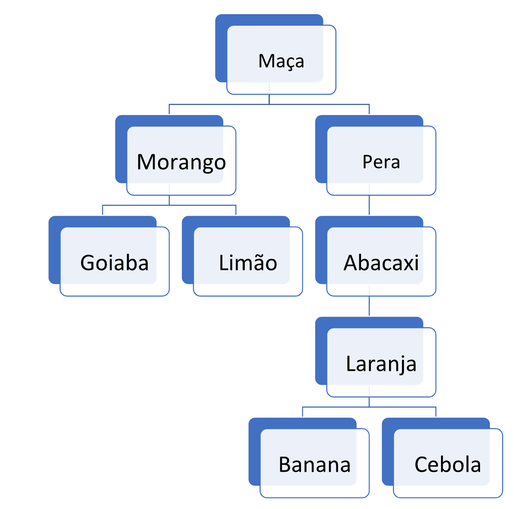

# Welcome to StackEdit!

1. 

## Dado o Array de inteiros abaixo, ordene-o de tal forma que os números “1” estejam à esquerda. Os itens devem ser modificados no lugar, ou seja, você não ira trocar posições e sim colocar os números “1” no inicio do Array. [2, 1, 5, 2, 5, 2, 1, 1, 1, 7, 9, 13, 127, 21]

    
    
2. 

## Dada a seguinte arvore binária de palavras, faça uma função que busque nessa arvore pela palavra-chave. O output da sua função deve ser o caminho até chegar no item procurado. Por exemplo, se o input de buscar for “goiaba” o output deve ser uma string “Maça -&gt; morango -&gt; Goiaba”.
```


```


3. 

## Dado o array de números inteiros [1, 15, 2, 7, 2, 5, 7, 1, 4] crie uma função que recebe um argumento X e retorne true ou false caso haja no array uma combinação de soma entre dois números que resulte no input X. Exemplo: Se X=2, a função deve retornar true pois existem dois números 1 dentro do array 1+1 = 2. Caso X=1231 a função deve retornar false pois não existe uma combina de dois números capazes de somar 1231.

4. 

## Dado o array [9, 2, 3, 1, 4] encontre todos os números que estão faltando para completar o intervalo 0 a n, onde n é o maior número dentro do array. Adicione os números faltando dentro do array.
